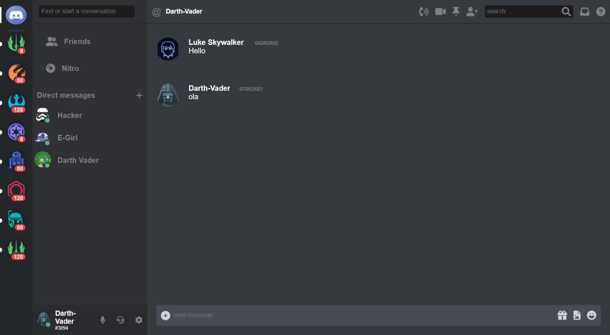

<link rel="stylesheet" href="https://cdn.jsdelivr.net/gh/devicons/devicon@v2.15.1/devicon.min.css">

# discord-wars
[LINK DEPLOY](https://discord-wars.surge.sh/)
Pequeno projeto envolvendo tecnologias raizes feito puramente com:

OBJETIVOS:
- manipulação do DOM com recuperação de dados enviados por input de usuario
- estilização com css puro e ordenação de nomes adequados para estrutura de classes, ids e outras tecnicas envolvendo a cascada da folha de estilos
- organização semantica de html optimizando a motores de busca organiza

 discord project clone

